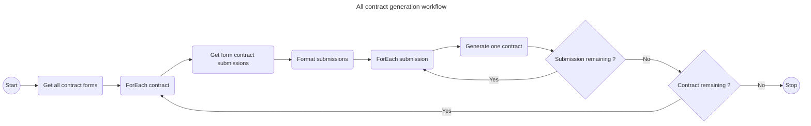
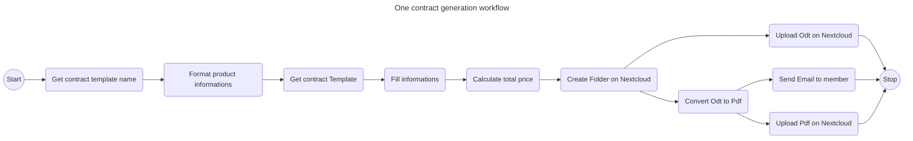
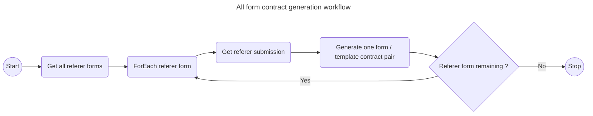
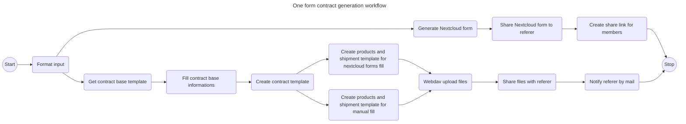

# AMAP Contract Generation

Collection of scripts responsible for the generation of all contracts, forms and templates for the Croix luizet AMAP.

This solution aims at replacing previous process of writing contracts. It's based on nextcloud forms and odt files.

## Glossary
**Shipment dates**: Delivery dates, can vary depending on the **contract type**

**Products**: Products that are sold by the productor, depends on **contract type**

**Basket**: AMAP basket defined by **products** and **shipment dates**

**Contract season**: Season during which the contract is in effect (Hiver-2025, Printemps-2026...)

**Contract type**: Type of the contract (Oeuf, Porc-Agneau, Legumineuses...)

**Contract form** : Contract for members, defined by a **contract season** and a **contract type**

**Contract template**: Cotnract template linked to a **contract form**

**Referer form**: Form for referer, this form allow referer to generate **contract form** and **contract template** for their AMAP Basket

## All contract generation
Generate all contracts based on new answers in *contract forms*.

## One contract generation
Generate a contract based on a specific answer in *contract form*.

## All form contract generation
Generate all form and templates based on new answers from *referer form*.

## One form contract generation
Generate a form and template based on a specifi answer from *referer form*.
